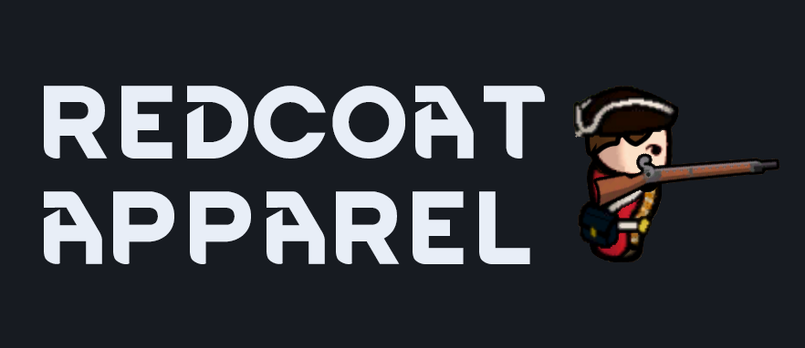

# Redcoat Apparel
Hi, I made a mod. You can check it out here along with the Steam Workshop :) If you're feeling adventurous, you can checkout the, \*gasp\*, dev branch.

# What comes in the box?
* 4 differently faced regimental coats and fatigue caps
* Stuffable civilian coat and hat
* 3 slightly different tricorn and cocked hats
* Bearskin cap and beaverskin hat
* Watch cloak and capote
* Hunting shirt
* Cartridge box and accoutrements

# What does not come in the box? (strongly recommended mods)
* Physical box
* Muskets (you should check out [Vanilla Weapons Expanded](https://steamcommunity.com/sharedfiles/filedetails/?id=1814383360) for some cool muskets (no bayonets))
* Appropriate hairstyles (did you know [Vanilla Hair Expanded](https://steamcommunity.com/sharedfiles/filedetails/?id=1888705256) has some period correct hair styles?)
* Hair to show with hats ([Show Hair With Hats](https://steamcommunity.com/sharedfiles/filedetails/?id=1180826364) has got you covered to make those hats look neat with hair)

Like what you see?
