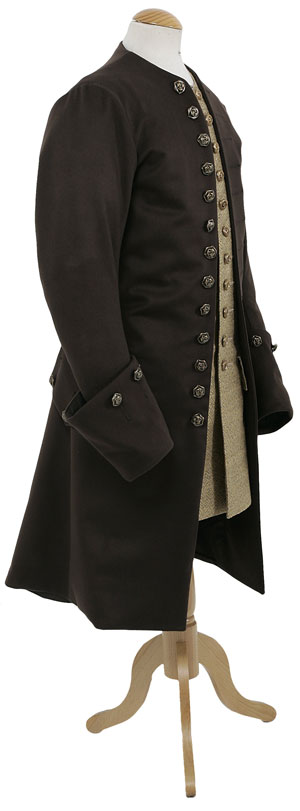

# Notes/Useful things to keep in mind
* Rimworld allows for an item in game that is made of different materials to have different textures/colors. This is done by multiplying the material color against against the texture file, which then renders a colored version of the texture file in the game. You can also turn that feature off for items, making them *exactly* as the texture file provided, or do a mix of both with am additional masking file. More on this [here](https://github.com/seraphile/rimshare/wiki/Colouring-in-Images) if you want to look into it.

In order to get good results with these variant textures (or *stuffable* objects), the textures should be black and white, and some gray gradient if needed for shading. Static items should be fully colored since nothing will be applied during render.

Rimworld's clothing layering system allows for multiple overlapping items to be worn and rendered at the same. This allows me to make for a ""realistic"" system that allows for customization of under and over layers. My current system for this is structured like so:

          shirts and waistcoats
        coats
      belts, bayonets, and misc stuff
    cold weather cloaks and capes

Rimworld doesn't allow for pants or sleeves, so don't worry about those.

It also uses the same side texture for both the left and right perspectives in game, so if there is anything with a specific side texture (such as bearskin or forage cap), it will get mirrored. There is nothing that can really be done about this so it's totally fine for it to look mirrored, pretend it got flipped or something ¯\\\_(ツ)\_/¯

If you have any questions or doubts, ***don't be afraid to message me and ask***. I would much rather you take your time on this, and ask twice and draw once.  

# OnSkin tops
  * shirt

    

      * you can probably get away modifying vanilla stuff, but try to make it tidier and more volumous
        * I put all of the textures for those into /assets/ for the github repo for you :)
      * 3 sides
        * white
          *  this will be a plain white shirt in the end, no coloring later
  * shirt and Waistcoat (stuffable)

    
    

      * I know sleeves aren't a thing, but do you think you can add some visible arm holes?

    * 3 sides
      * grayscale
        * **make this just white for now** like the previous one, i'll figure out more with this later
      *  ~~fancy Shirt and Waistcoat (stuffable)~~ let me figure out how to implement them, let's discuss this later

# Middle tops
**PLEASE NOTE:** the middle of these textures should be transparent, which should allow lower layered items to show through, here is an example:

This would allow for stuff worn under it to be visible.

* #### simple coat (stuffable)

  

  

    * ignore the waistcoat and shirt and frills, those can be rendered by the shirt/waistcoat object itself
    * maybe add a little shading to buttons/lapel so they are a bit more distinct and visible?
  * 3 sides
    * grayscale
    * ~~fancy coat variation~~ let me figure out how to implement these
      * ~~3 sides as simple coat, gold inlays + mask~~
* #### hunting frock (stuffable)
  
  

  * 3 sides
    * grayscale
* #### Regimental coats
  * *please make the buttons a silver or neutral color (not gold/brass)*
  * 3 sides, red main color
    * blue facings

      
    * green facings (the specific rgb for this color is 166,194,56 but will probably need to be tweaked a little to account for "lighting" and wear)

        

    * white facings

      
    * yellow facings

      

    Note how these are all almost identical except for the colors on the lapels. Ignore the parts on the shoulders. These are laid out flat so there isn't an accurate form of how theyre worn. Refer to this instead; you can see that the sides start going outwards halfway up the chest.

      

      Also, these coats start splitting in half pretty high up. While it wouldn't be possible to depict all of it, it would be nice to start the split on the back and draw the extra buttons on the back.
      

      Once again, please message me if you have any questions of clarifications :)

# Over tops
* #### watch cloak (stuffable)

  

  * 3 sides
    * greyscale
* #### capote

    
    

    * try to base it off of the right artwork, white/cream main color with some dark blue accents. Also, note the folded hood on the back
      * those accents are not really in good places that show in Rimworld, but I'm sure you can make something up ;) it doesn't have to be much

    * 3 sides
      * one fixed texture

# Hats
* #### cocked Hat (stuffable)

  

    * 3 sides
      * greyscale, with some shading for the edge/ties on the front
      * black

      

        * with a black ribbon
	  * black/white trim

        

        * with a **black** ribbon, keep the white trim and rope on the sides
    * ~~fancy Hat variation (stuffable)~~
        * ~~3 sides as cocked hat, gold inlays + mask~~

  **NOTE:** the black and black/white hats should have the pointed corner over the left eye rather than centered on the head, the plain one should be centered
* #### grenadier bearskin

  
  
  

    * 3 sides
      * *silver* front texture

  Some comments on the sample you provided:
    * front plate is a little narrow, should be a bit wider like this:
      * 
    * also to have part of the cord visible on the bottom of one sides
    * make the metal inlay silver rather than gold
    * no detail on the bottom brim
    * *maybe* add a small hint of brown to the fur (if it turns out kind of weird, then lets keep just black, but I'm curious as to the interim result)
    * otherwise perfect :)
* #### beaver fur hat

  
  

  * 3 sides fixed texture
* #### Forage Caps

  
  

 -  3 sides
    - blue facings
    - green facings
    - white facings
    - yellow facings

    For the different facings, just replace the yellow with whatever color is in there, don't worry about putting down the number

### Belts
Give me a bit to decide as to how to have these done, I will update later

  - cartridge Box/Waistbelt (white)
    - 3 sides fixed white textures
  - crossbelts
    - 3 sides fixed white textures
  - waistbelt Box
    - 3 sides fixed brown textures
