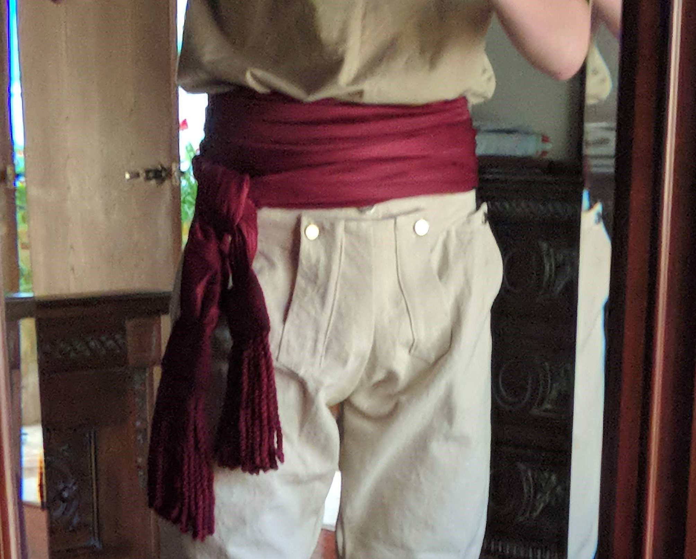
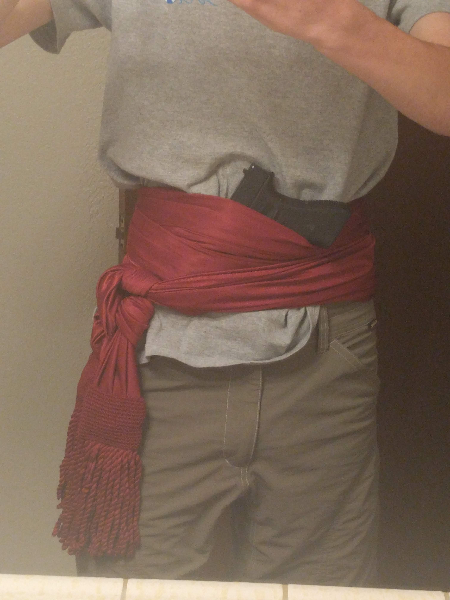

Thanks for taking on round 2 for this project! This time around some of the project parameters have changed.

* asset resolution should be 256x256 pixels instead of 128x128
* the gray color for grayscale shading should be lighter (around #acacac - #d8d8d8 should be good)
* inlay mask files (black = ignore, red = recolor)

### Item 1
Fancy styled shirt/waistcoat
* white shirt under
* grayscale waistcoat
* fancy inlays/design in gold/silver color (or whatever works best)
* white shirt ruffles protruding on top of center of waistcoat
*
#### 3 sides * 5 body types

### Item 2
Fancy Coat
* grayscale coat
* fancy inlays/design in gold/silver color (or whatever works best)
*
#### 3 sides * 5 body types

### Item 3
~~Fancy Hat~~

* Let me do some more research on specifics, but bill me now
* #### 3 sides

### Item 4
Red Sash
* just a red silk fabric wrapped around
* #### 3 sides * 5 body types

### Examples

just waistcoat

with shirt ruffles in the middle

coat and waistcoat

ruffles in this one are very exaggerated, but kind of the rough idea

some pictures of the sash, note that these are mirrored, so the tail should be on the right side of the texture
